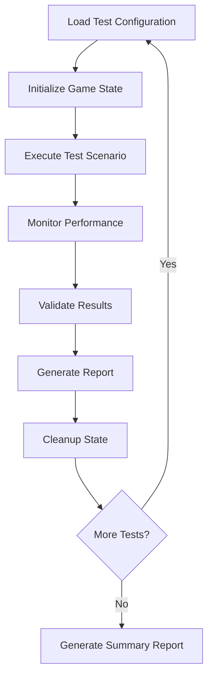

# Design Document

## Overview

This design outlines a comprehensive testing approach for the spawn system in the web viewer. The testing will be conducted through a systematic progression from basic spawn creation to complex interactions, using both manual testing scenarios and automated verification methods. The design focuses on end-to-end validation of the spawn system integration with the web viewer's rendering, physics, and interaction systems.

## Architecture

### Testing Environment Setup

The testing will be conducted in the existing web viewer environment with enhanced debugging capabilities:

```
Web Viewer Testing Stack:
├── Game Engine (WASM) - Spawn logic and state management
├── WASM Wrapper - JavaScript interface for spawn operations
├── Web Viewer UI - Visual rendering and user interaction
└── Debug Tools - State inspection and validation utilities
```

### Test Configuration System

A dedicated test configuration system will be created to systematically test different spawn scenarios:

```typescript
interface SpawnTestConfig {
  testName: string
  characters: CharacterConfig[]
  spawns: SpawnConfig[]
  behaviors: BehaviorConfig[]
  expectedOutcomes: ExpectedOutcome[]
  validationCriteria: ValidationCriteria[]
}
```

### Validation Framework

The testing will use a multi-layered validation approach:

1. **Visual Validation**: Manual inspection of spawn rendering and behavior
2. **State Validation**: Automated checking of game state consistency
3. **Performance Validation**: Monitoring of frame rates and memory usage
4. **Integration Validation**: Verification of spawn-character interactions

## Components and Interfaces

### Test Configuration Manager

Manages different test scenarios and configurations:

```typescript
class SpawnTestManager {
  loadTestConfig(testName: string): SpawnTestConfig
  executeTest(config: SpawnTestConfig): TestResult
  validateResults(result: TestResult): ValidationReport
  generateReport(results: TestResult[]): TestSummary
}
```

### Spawn Validation System

Validates spawn behavior and state consistency:

```typescript
interface SpawnValidator {
  validateSpawnCreation(
    expectedSpawns: SpawnConfig[],
    actualState: GameState
  ): boolean
  validateSpawnPhysics(
    spawn: SpawnState,
    expectedBehavior: PhysicsBehavior
  ): boolean
  validateSpawnCollisions(
    spawn: SpawnState,
    collisionExpectations: CollisionExpectation[]
  ): boolean
  validateSpawnLifecycle(
    spawn: SpawnState,
    lifecycleExpectations: LifecycleExpectation[]
  ): boolean
}
```

### Performance Monitor

Tracks performance metrics during spawn testing:

```typescript
interface PerformanceMonitor {
  startMonitoring(): void
  recordFrameRate(): number
  recordMemoryUsage(): MemoryMetrics
  recordSpawnCount(): number
  generatePerformanceReport(): PerformanceReport
}
```

### Visual Inspection Tools

Provides debugging overlays and inspection capabilities:

```typescript
interface VisualDebugger {
  showSpawnBounds(enabled: boolean): void
  showCollisionBoxes(enabled: boolean): void
  showVelocityVectors(enabled: boolean): void
  showSpawnProperties(spawnId: number): void
  highlightSpawnInteractions(enabled: boolean): void
}
```

## Data Models

### Test Configuration Model

```typescript
interface SpawnTestConfig {
  testName: string
  description: string

  // Initial game setup
  characters: {
    position: [number, number]
    behaviors: BehaviorId[]
    properties: CharacterProperties
  }[]

  // Spawn configurations to test
  spawns: {
    spawnType: SpawnType
    initialPosition: [number, number]
    initialVelocity: [number, number]
    properties: SpawnProperties
    expectedLifespan: number
  }[]

  // Test execution parameters
  testDuration: number // frames
  validationPoints: number[] // frames to validate at

  // Expected outcomes
  expectedSpawnCount: number[]
  expectedPositions: [number, number][]
  expectedCollisions: CollisionExpectation[]
  expectedCleanup: CleanupExpectation[]
}
```

### Validation Result Model

```typescript
interface ValidationResult {
  testName: string
  passed: boolean
  timestamp: Date

  // Detailed results
  spawnCreationResults: SpawnCreationResult[]
  physicsValidationResults: PhysicsValidationResult[]
  collisionValidationResults: CollisionValidationResult[]
  performanceResults: PerformanceResult

  // Issues found
  issues: TestIssue[]
  warnings: TestWarning[]

  // Summary metrics
  totalSpawnsCreated: number
  totalSpawnsDestroyed: number
  averageFrameRate: number
  peakMemoryUsage: number
}
```

## Error Handling

### Test Execution Error Handling

```typescript
class TestExecutionError extends Error {
  constructor(
    public testName: string,
    public phase: TestPhase,
    public details: string
  ) {
    super(`Test ${testName} failed in ${phase}: ${details}`)
  }
}
```

### Validation Error Handling

```typescript
interface ValidationError {
  type: 'SPAWN_CREATION' | 'PHYSICS' | 'COLLISION' | 'LIFECYCLE' | 'PERFORMANCE'
  severity: 'ERROR' | 'WARNING' | 'INFO'
  message: string
  expectedValue: any
  actualValue: any
  frame: number
}
```

### Recovery Strategies

- **Test Isolation**: Each test runs in a fresh game state to prevent interference
- **Graceful Degradation**: Continue testing even if individual validations fail
- **Error Reporting**: Comprehensive logging of all issues for debugging
- **State Reset**: Automatic cleanup between tests to ensure consistent starting conditions

## Testing Strategy

### Test Categories

#### 1. Basic Spawn Creation Tests

- Single spawn creation
- Multiple spawn creation
- Spawn creation with different configurations
- Spawn creation timing and positioning

#### 2. Physics and Movement Tests

- Spawn gravity and falling behavior
- Spawn velocity and movement
- Spawn collision with environment
- Spawn physics property variations

#### 3. Interaction Tests

- Spawn-character collisions
- Spawn-spawn interactions
- Spawn triggering character behaviors
- Character actions affecting spawns

#### 4. Lifecycle Tests

- Spawn lifespan and automatic cleanup
- Manual spawn destruction
- Spawn cleanup on game reset
- Memory management validation

#### 5. Performance Tests

- High spawn count scenarios
- Rapid spawn creation/destruction
- Long-running spawn scenarios
- Memory leak detection

#### 6. Edge Case Tests

- Spawn creation at boundaries
- Spawn creation with invalid parameters
- Spawn behavior with extreme values
- Spawn system under stress conditions

### Test Execution Flow



### Validation Checkpoints

Tests will include validation at specific checkpoints:

- **Frame 0**: Initial state validation
- **Frame 30**: Early behavior validation
- **Frame 60**: Mid-test state validation
- **Frame 120**: Extended behavior validation
- **Final Frame**: Cleanup and final state validation

## Integration Points

### WASM Integration

The testing system will interface with the WASM layer through:

- `get_spawns_json()` - Retrieve current spawn state
- `step_frame()` - Advance game simulation
- `new_game()` - Reset game state for fresh tests
- Performance monitoring hooks for frame timing

### Web Viewer Integration

Integration with the web viewer will include:

- Visual rendering validation
- User interaction simulation
- Debug overlay activation
- Performance metric collection from the rendering pipeline

### Debug Tool Integration

The testing system will integrate with existing debug tools:

- Console logging for detailed state information
- Visual debugging overlays for spawn inspection
- Performance profiling integration
- State export/import for test reproducibility

## Success Criteria

### Functional Success Criteria

- All spawn creation scenarios work correctly in the web viewer
- Spawn physics and movement behave as expected visually
- Spawn collisions are detected and handled properly
- Spawn lifecycle management works without issues
- Spawn-character interactions function correctly

### Performance Success Criteria

- Frame rate remains above 30 FPS with up to 50 active spawns
- Memory usage increases linearly with spawn count
- No memory leaks detected during spawn lifecycle
- Spawn creation/destruction has minimal performance impact

### Quality Success Criteria

- All test scenarios pass validation
- No visual artifacts or rendering issues
- Consistent behavior across multiple test runs
- Comprehensive test coverage of spawn system features
